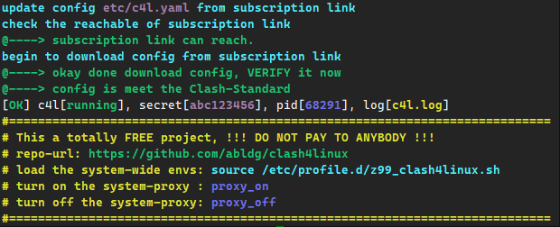

[TOC]

<br>

If you enjoy this project, please give it a star!  


---
[Chinese (README)](../README.md)


# Project Introduction

This project utilizes the open-source tool [ClashPermium]() as its core program, combined with custom scripts to implement a simple proxy solution.

The primary purpose of this project is to address the slow download speeds for GitHub and other overseas resources on servers.

---

# Disclaimer

1. This project is licensed under the GNU General Public License (GPL) v3.0. Please review the LICENSE file in this repository for details.

2. The original authors of this project retain all intellectual property rights. Users must comply with the requirements of the GPL v3.0 and bear all risks associated with using this project.

3. This project is provided "as is" without any explicit or implicit guarantees. To the fullest extent permitted by law, the original authors are not liable for any direct, indirect, special, incidental, or consequential damages.

4. This project and its repository are entirely unrelated to the creator and maintainer. It is solely a backup repository, and any disputes, conflicts, or losses arising from using this project are entirely unrelated to the author or maintainer.

5. Users must adhere to the laws and regulations of their own country and resolve any legal or regulatory issues arising from the use of this project on their own.

---

# Usage Notes

- It is recommended to run this project as the [root]() user or with [`sudo`]() privileges.
- When submitting an issue, ensure that sensitive information (e.g., subscription URLs) is removed or replaced.
- The Dashboard is from [YACD](https://github.com/haishanh/yacd). For detailed configurations, please refer to the original projects.
- This project does not provide any subscription information. You must prepare your own Clash subscription URL.
- Before running, manually modify the `C4L_LNKURL` variable in the `.env` file, or the program will not work correctly.
- Tested on RHEL series, Debian, Kali Linux, Ubuntu, and other Linux systems. Other distributions may require minor script modifications.
- Supports x86_64 and aarch64 platforms.
- [Note:]()
  - For some Linux desktop systems, you may need to set the proxy in your browser for proper usage.
  - If the system proxy doesn't work, but you need it, try modifying the port and reloading the environment variables.
  - If issues persist, consider changing your network environment (this may also be a factor).
  - On some Linux systems, sites like Google, Twitter, or YouTube may not respond to ping requests—this is normal.
- [References:]()
  - Lookup for what about Clash: <https://clash.wiki>
  - Download other platform clash4linux from: <https://downloads.clash.wiki/ClashPremium>
---

# Usage Guide

## Install depends

```bash
## Debian/Ubuntu
apt update -y && apt install -y git curl make

## RHEL/OpenEuler/CentOS
yum update -y && yum install -y git curl make
```

## Download the Project

> Clone the project repository

```bash
git clone https://github.com/abldg/clash-for-linux-server.git /opt/clash4linux
```

## Upate the subscription URLs

```bash
##step into the repository dir
cd /opt/clash4linux

##update subscription URLs <must>
##webpage-password[optional]
make uptenv < LNKURL=URLs > [SECRET=UI_PASWD]
```

---

## Start the Program

- Navigate to the project directory:

```bash
$ cd /opt/clash4linux && make enable_proxy
```

- The Startup Output likes:



- Check service ports:

```bash
$ netstat -tln | grep -E '9090|789.'
tcp        0      0 127.0.0.1:9090          0.0.0.0:*               LISTEN     
tcp6       0      0 :::7890                 :::*                    LISTEN     
tcp6       0      0 :::7891                 :::*                    LISTEN     
tcp6       0      0 :::7892                 :::*                    LISTEN
```

- Check environment variables:

```bash
$ env | grep -E 'http_proxy|https_proxy'
http_proxy=http://127.0.0.1:7890
https_proxy=http://127.0.0.1:7890
```

If the above steps are successful, the Clash program is running, and you can now experience faster downloads for GitHub resources.

- load `enable_proxy` and `disable_proxy`

```bash
$ source /etc/profile.d/z99_clash4linux.sh
$ enable_proxy
```

---

## Stop the Program

- Navigate to the project directory:

```bash
cd /opt/clash4linux && make disable_proxy
```

Stop the system proxy:

```bash
$ disable_proxy
```

Verify that the program's ports, processes, and environment variables (`http_proxy|https_proxy`) are no longer active. If none are active, the service has successfully stopped.

---

## Clash Dashboard

- Access the Clash Dashboard:

Use a browser to visit the URL provided in the `start.sh` output, e.g., `http://192.168.0.1:9090/ui`.

- Log in to the management interface:

Enter `http://<ip>:9090` in the `API Base URL` field and the secret provided in the `start.sh` output in the `Secret (optional)` field.

Click "Add" and select the newly added management interface to configure Clash via the browser.

- Additional Tutorials:

This Clash Dashboard uses the [YACD](https://github.com/haishanh/yacd) project. For more detailed usage instructions, refer to the YACD repository.
